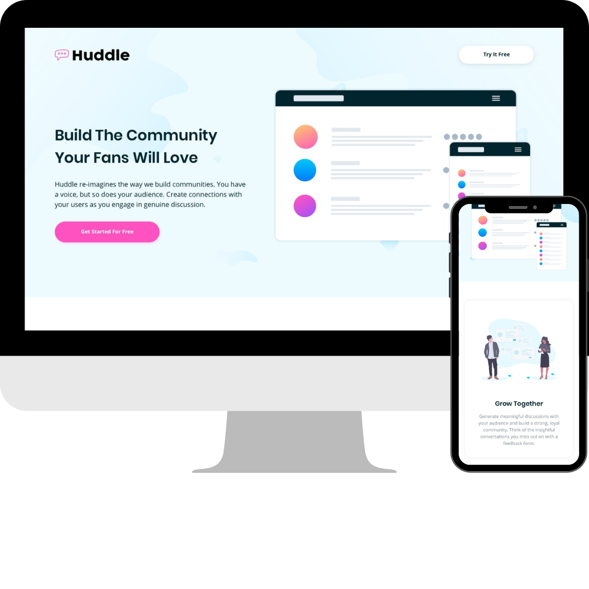

# Frontend Mentor - Huddle landing page with alternating feature blocks solution

This is a solution to the [Huddle landing page with alternating feature blocks challenge on Frontend Mentor](https://www.frontendmentor.io/challenges/huddle-landing-page-with-alternating-feature-blocks-5ca5f5981e82137ec91a5100). Frontend Mentor challenges help you improve your coding skills by building realistic projects. 

## Table of contents

- [Overview](#overview)
  - [The challenge](#the-challenge)
  - [Screenshot](#screenshot)
  - [Links](#links)
- [My process](#my-process)
  - [Built with](#built-with)
  - [What I learned](#what-i-learned)
  - [Continued development](#continued-development)
  - [Useful resources](#useful-resources)
- [Author](#author)
- [Acknowledgments](#acknowledgments)

## Overview

### The challenge

Users should be able to:

- View the optimal layout for the site depending on their device's screen size
- See hover states for all interactive elements on the page

### Screenshot



### Links

- Solution URL: [Github](https://github.com/allfigueiredodev/huddle-landing-page)
- Live Site URL: [Github Pages](https://allfigueiredodev.github.io/huddle-landing-page/)

## My process

### Built with

- Semantic HTML5 markup
- CSS
- Flexbox
- SASS
- Mobile-first workflow
- Git
- Github

### What I learned

This was my first project using SASS, I tried to use a little bit of everything that I learned.

```css
@mixin before  ($url, $margin: 0) {
  content: url($url);
  display: inline-block;
  width: 25px;
  height: 25px;
  margin-right: $margin;
}
```

### Continued development

I need to develop more projects using SASS to get more familiar with it. 

## Author

- Website - [Allesson Figueiredo](https://github.com/allfigueiredodev)
- Frontend Mentor - [@allfigueiredodev](https://www.frontendmentor.io/profile/allfigueiredodev)